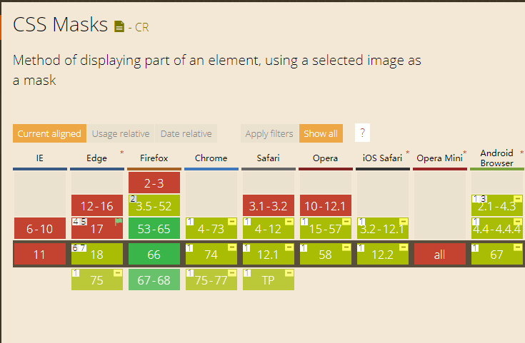
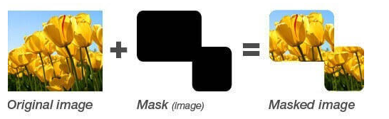
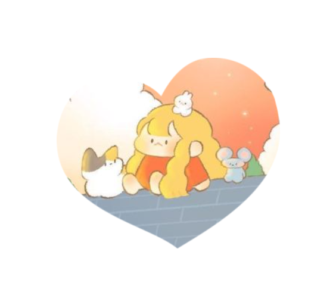
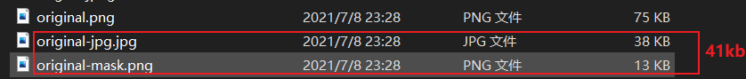

### 一、现状

+ Firefox，Chrome以及移动端等都已经全线支持，尤其Firefox浏览器，从版本53开始，已经全面支持了CSS3 mask属性.




 

### 二、Mask 的原理

+ 蒙板可以是 CSS3 渐变或者半透明的PNG图片，蒙板元素的alpha值为0的时候会覆盖下面的元素，为1的时候会完全显示下面的内容。如下：





### 三、mask属性

+ `mask`属性实际上已经成为了诸多`mask-*`的缩写，这和`background`, `border`性质是一样的。

#### 3.1.【mask-image】

`mask-image`指遮罩使用的图片资源，默认值是`none`，也就是无遮罩图片。因此，和`border`属性中的`border-style`属性类似，是一个想要有效果就必须设定的属性值。


`mask-image`遮罩所支持的图片类型非常的广泛，可以是`url()`静态图片资源，格式包括JPG，PNG以及SVG等都是支持的；也可以是动态生成的图片，例如使用各种CSS3渐变绘制的图片，同时还支持`多背景`，因此理论上，使用`mask-image`我们可以遮罩出任意我们想要的图形，非常强大。

```css
/* 图片资源 */
-webkit-mask-image: url(mask.png);
/* css的渐变属性 */
 -webkit-mask-image: linear-gradient(to bottom, rgba(0,0,0,1), rgba(0,0,0,0)); 
```


#### 3.2.【mask-repeat】

默认值为repeat，可选值与background-repeat相同。

```css
/* 单个值 */
-webkit-mask-repeat: no-repeat | repeat-x | repeat-y | space | round | repeat(默认值);
/* 两个值 horizontal(水平)  vertical(垂直) （以下仅为示例）*/
-webkit-mask-repeat: repeat space | repeat repeat | round space | no-repeat round;

/* Multiple values */
-webkit-mask-repeat: space round, no-repeat;
-webkit-mask-repeat: round repeat, space, repeat-x;

/* 多层遮罩 */
mask-image: url('mask1.png'), url('mask2.png');
mask-repeat: repeat-x, repeat-y;
```

**round**：当背景图像不能以整数次平铺时，会根据情况缩放图像。（CSS3）

**space**：当背景图像不能以整数次平铺时，会用空白间隙填充在图像周围。（CSS3）


#### 3.3.【mask-position】

默认值为0 0，可选值与background-position相同。

```css
mask-position: top;
mask-position: bottom;
mask-position: left;
mask-position: right;
mask-position: center;
mask-position: 30% 50%;
mask-position: 10px 5rem;
```

由于`mask-image`支持多遮罩图片，因此，`mask-position`也支持多属性值，例如：

```css
mask-position: 0 0, center;
```

#### 3.4.【mask-clip】

默认值为border-box，可选值与background-clip相同。

```css
-webkit-mask-clip: content-box | padding-box | border-box | margin-box | fill-box | stroke-box | view-box | no-clip;

-webkit-mask-clip: border-box;
-webkit-mask-clip: padding-box;
-webkit-mask-clip: content-box;
-webkit-mask-clip: text;

/* Multiple values */
-webkit-mask-clip: padding-box, no-clip;
-webkit-mask-clip: view-box, fill-box, border-box;
```


#### 3.5.【mask-origin】

默认值为border-box，可选值与background-origin相同。

```css
/* Keyword values */
mask-origin: content-box;
mask-origin: padding-box;
mask-origin: border-box;
mask-origin: margin-box;
mask-origin: fill-box;
mask-origin: stroke-box;
mask-origin: view-box;

/* Multiple values */
mask-origin: padding-box, content-box;
mask-origin: view-box, fill-box, border-box;

/* Non-standard keyword values */ 
-webkit-mask-origin: content; 
-webkit-mask-origin: padding; 
-webkit-mask-origin: border;
```

#### 3.6.【mask-size】

默认值为auto，可选值与background-size相同。

```css
.divTest{
    padding: 40px;
    background-color: #03ff36;
    background-image: url(http://cdn01.baidu-img.cn/timg?image_search&quality=80&size=b10000_10000&sec=1470644878&di=f054ab9449175833cf84b3429acacd88&imgtype=jpg&src=http%3A%2F%2Fimg0.bdstatic.com%2Fimg%2Fimage%2Fshouye%2Fxiaoxiao%2Fis099s8ky-PC.jpg));
    -webkit-mask-image: url(http://image27.360doc.com/DownloadImg/2011/04/2015/11077777_58.png)), url(http://img.t.sinajs.cn/t6/style/images/global_nav/WB_logo.png));
    -webkit-mask-repeat: space,repeat-y;
    -webkit-mask-clip: text; 
    -webkit-mask-size: 5%, 8%;
    border: 30px solid red;
}
```


### 四、实战

#### 4.1.图形蒙版

+ 简单使用

```html
<style>
    img{
        -webkit-mask-image: url(img/mask1.png);
        -webkit-mask-repeat:no-repeat;
        -webkit-mask-position: center;
    }
</style>

```

+ 效果

  

+ mask 支持 svg, png 还可以用 gif，如cdepen上有人用mask 做了个海绵宝宝动画。[【查看demo】](https://codepen.io/banik/pen/aRpvdW)

#### 4.2.渐变蒙版

```css
 -webkit-mask-image: -webkit-gradient(linear,left top,left bottom,from(rgba(0,0,0,1)),to(rgba(0,0,0,0)));
```

+ 效果


#### 4.3.蒙版位置

+ 4.1基础上，改变-webkit-mask-position: center;
+ 作用：可用于app使用引导。

```js
(function(window){
    var img = document.getElementById('img'),
        isIn = false;
    img.onmouseover = function(e){
        isIn = true;
    }

    img.onmousemove = function(e){
        if(isIn){
            img.style.cssText = '-webkit-mask-position:'+(e.pageX-150)+'px '+(e.pageY-123)+'px;'
        }
    }
    img.onmouseout = function(e){
        isIn = false;
    }
})(window)
```


#### 4.4.蒙版动画

+ https://codepen.io/HelKyle/pen/ePyENP/

#### 4.5.蒙版动画-转场

HTML结构:

```
<div class="sec1"></div>
<div class="sec2"></div>
```

CSS：

```css
* {margin: 0;padding: 0;}
html,body{width: 100%;height: 100%;overflow: hidden;}
.sec1,.sec2{
    width: 100%;
    height:100%;
}
.sec1 {
    background: url(img/bg2.jpg) center top no-repeat;
    position: absolute;
    left:0;
    top: 0;
}

.sec2 {
    background: url(img/bg3.jpg) center top no-repeat;
}
/**center**/
.sec1 {
    -webkit-mask-image: url(img/mask-center.png);
    -webkit-mask-size: 3000% 100%;
    -webkit-mask-position: 0 center;
    animation: startMask 9.8s steps(29) both 1;
}
@keyframes startMask {
    to {
        -webkit-mask-position: 100% center;
        mask-position: 100% center
    }
}
/**top**/
.sec1 {
    -webkit-mask-image: url(img/mask-left-top.png);
    -webkit-mask-size:100% 3000% ;
    -webkit-mask-position:0 0;
    animation: startMask 9.8s steps(29) both 1;
}

@keyframes startMask {
    to {
        -webkit-mask-position:0 100% ;
        mask-position: 0 100%
    }
}
/**down**/
.sec1 {
    -webkit-mask-image: url(img/mask-down.png);
    -webkit-mask-size:4000% 100% ;
    -webkit-mask-position: 0 center;
    animation: startMask 9.8s steps(39) both 1;
}

@keyframes startMask {
    to {
        -webkit-mask-position: 100% center;
        mask-position:  100% center
    }
}
/**left**/
.sec1 {
    -webkit-mask-image: url(img/mask-left-top.png);
    -webkit-mask-size:100% 3000% ;
    -webkit-mask-position:0 0;
    animation: startMask 9.8s steps(29) both 1;
}

@keyframes startMask {
    to {
        -webkit-mask-position:0 100% ;
        mask-position: 0 100%
    }
}
```


#### 性能优化

```html
<style>
	.original-mask{ -webkit-mask: url(img/original-mask.png) no-repeat;}
</style>

```




